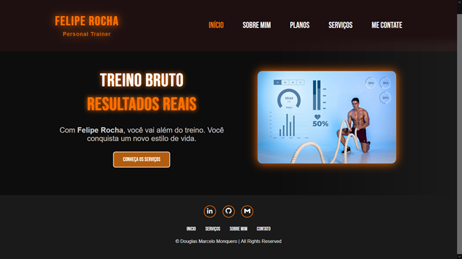
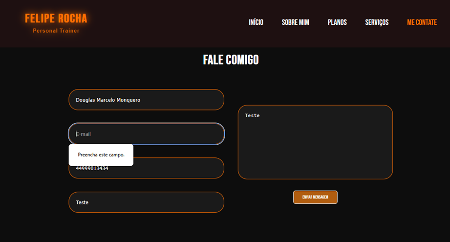

---

## 🛠️ Tecnologias Utilizadas

- HTML5
- CSS3 (com Media Queries, Flexbox, variáveis CSS)
- JavaScript Vanilla (sem frameworks)
- Ferramentas: [Chrome DevTools](https://developer.chrome.com/docs/devtools/), [Firefox DevTools](https://developer.mozilla.org/pt-BR/docs/Tools), [Google PageSpeed Insights](https://pagespeed.web.dev/), [Lighthouse](https://developer.chrome.com/docs/lighthouse/)

---

## 📸 Capturas de Tela

### 💻 Versão Desktop

### 📱 Versão Mobile

### ✉️ Formulário Validando

---

## 📚 Relatório Técnico

Um relatório detalhado com escolhas de design, arquitetura e justificativas técnicas pode ser acessado neste repositório: 
 📄 [Acesse o Relatório Técnico (PDF)](./documento/Relatorio_Treino_Bruto.pdf)

---

## 👤 Autor

Douglas Marcelo Monquero  
📧 [Contato via GitHub](https://github.com/dmm76)  
🎓 Unicesumar Maringá Paraná – Bacharelado em Engenharia de Software - Disciplina de FrontEnd

---

## 📝 Licença

Este projeto está sob a licença MIT. Consulte o arquivo [LICENSE](LICENSE) para mais detalhes.

